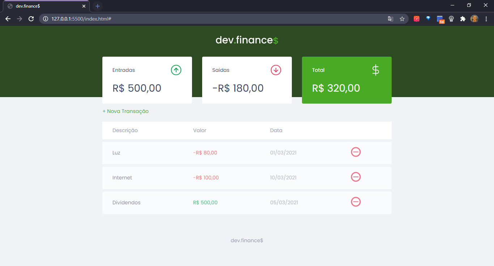
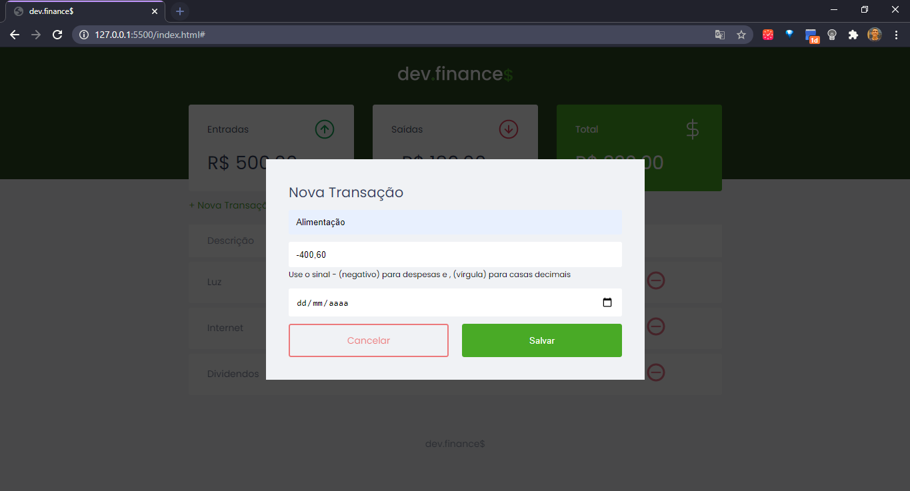

 
 <h1 align="center">
 
 </h1>

🚀 Aplicação web para controle financeiro

<a href="#-tecnologias">Tecnologias</a> |
  <a href="#-projeto">Projeto</a> |
  <a href="#-layout">Layout</a> |
  <a href="#memo-licença">Licença</a> |
  <a href="#-creditos">Creditos</a>

## 🚀 Tecnologias

Esse projeto foi desenvolvido com as seguintes tecnologias:

- HTML
- CSS
- JavaScript

## 💻 Projeto

O dev.finances é uma aplicação de controle financeiro, onde é possível cadastrar e excluir transações e ver o saldo de entrada e saída 💰

## 🔖 Layout

## :memo: Licença

Esse projeto está sob a licença MIT. Veja o arquivo [LICENSE](LICENSE.md) para mais detalhes.

## 🏆 Creditos
Feito por mim junto com a [Rocketseat](https://github.com/Rocketseat)
